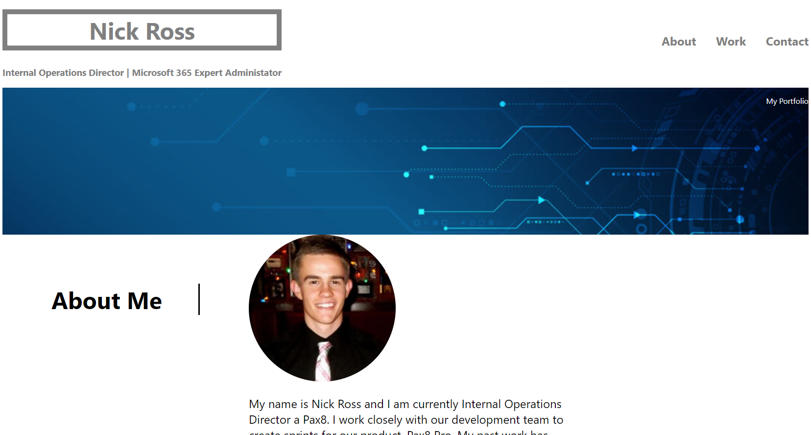
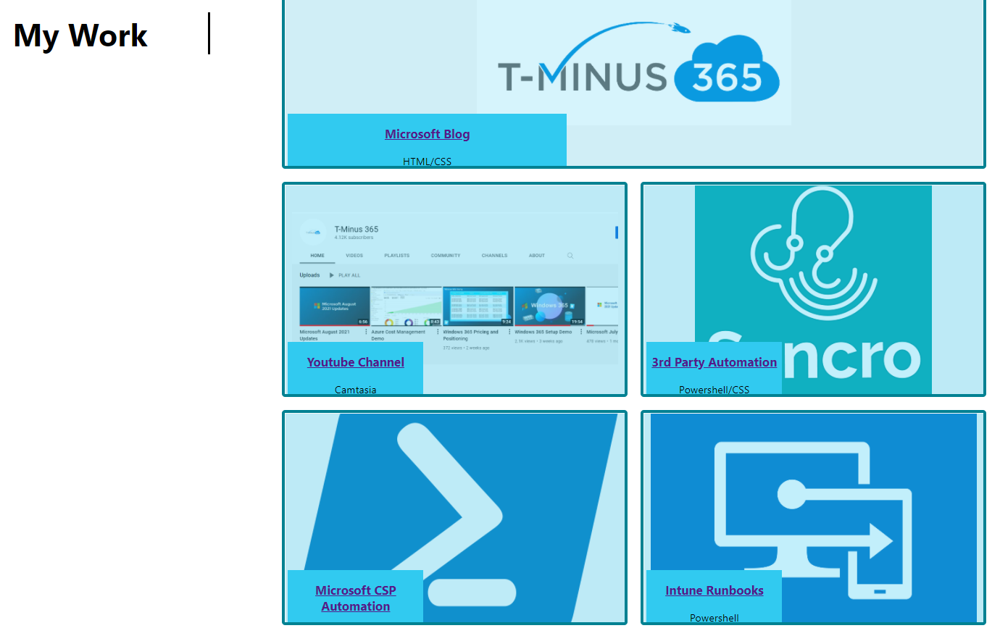

#Nick Ross Porfolio

The following project was conducted to create a landing page for a personal portfolio. The page includes deep links to exmaples of my work and is completely responsive. The entire page was made with HTML and CSS.

<H2>Author</H2>
Nick Ross

<H2>My Work</H2>

Color overlay here with deep links to my blog, youtube channel, and github repositories. The flex grid is completely responsive. Hovering over image text creates tranform animation.

<H2>Responsive Design</H2>

All componets are responsive to different media sizes/

