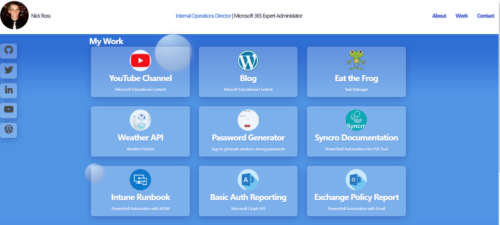
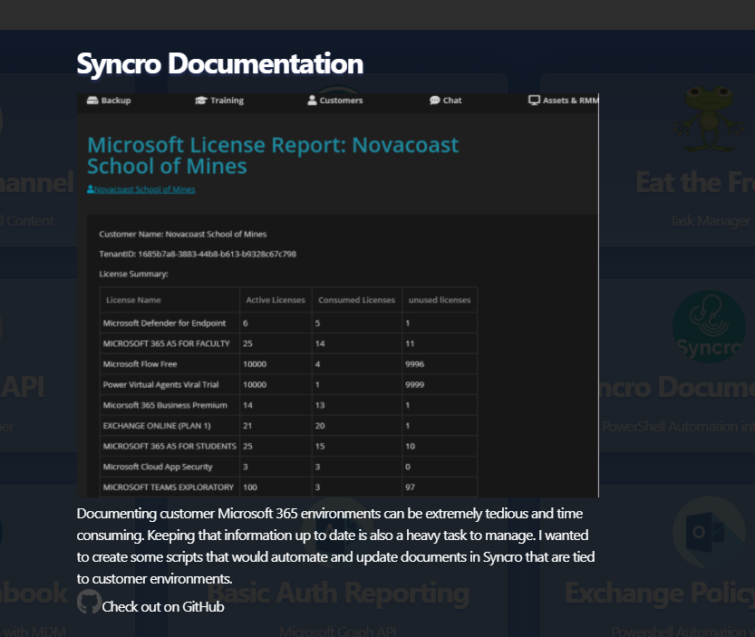
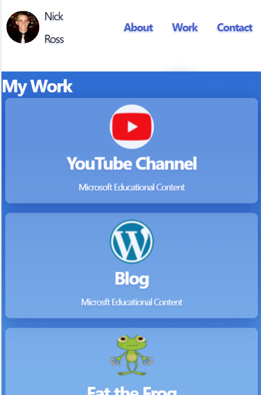

# NICK ROSS PORTFOLIO

[](https://github.com/msp4msps)
[](https://github.com/msp4msps/Nick_Ross_portfolio)
[](https://github.com/msp4msps/Nick_Ross_portfolio)
[](https://choosealicense.com/licenses/mit/)

## Table of Content

- [ Project Links ](#Project-Links)
- [ Screenshots](#Screenshots)
- [ Project Description ](#Project-Description)
- [ Questions ](#Questions)
- [ License ](#License)

#

## Project Links

https://github.com/msp4msps/Nick_Ross_portfolio<br>
https://msp4msps.github.io/Nick_Ross_portfolio/

## Screenshots-Demo

<kbd></kbd><kbd></kbd><kbd></kbd>

## Project Description

The following project was conducted to create a landing page for a personal portfolio. The page includes deep links to exmaples of my work and is completely responsive. The entire page was made with HTML, CSS, Bulma, Java Script, NodeJS, MySQL

## Technologies

```
Javascript, Html, CSS
```

## Questions

Contact the author with any questions!<br>
Github link: [msp4msps](https://github.com/msp4msps)<br>
Email: msp4msps@tminus365.com

## License

This project is [MIT](https://choosealicense.com/licenses/mit/) licensed.<br />
Copyright © 2022 [NICK ROSS](https://github.com/msp4msps)
